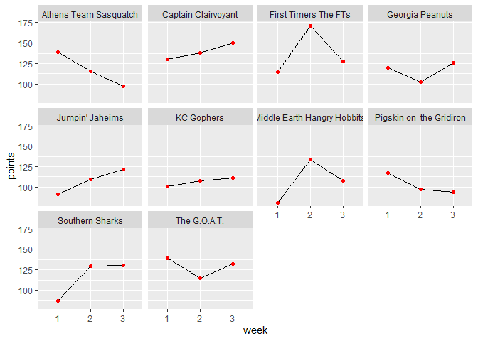

PCFL: Week 3 wrap-up
================

### Last week’s games

| away\_team              | awaypoints | home\_team                  | homepoints |
| :---------------------- | ---------: | :-------------------------- | ---------: |
| Southern Sharks         |     130.10 | The G.O.A.T.                |     132.15 |
| First Timers The FTs    |     127.80 | Middle Earth Hangry Hobbits |     107.54 |
| Captain Clairvoyant     |     150.32 | Jumpin’ Jaheims             |     121.74 |
| KC Gophers              |     111.08 | Athens Team Sasquatch       |      97.48 |
| Pigskin on the Gridiron |      93.90 | Georgia Peanuts             |     125.70 |

Last week’s games were mostly comfortable wins, with one exception. The
Southern Sharks choked on the G.O.A.T., coming up just two points short.
The Jumpin Jaheims were our hard luck case for their week, as Evan’s 121
points would have beat five other teams. Unfortunately he was up against
our current points leader (Captain Clairvoyant), who scored the second
highest one week total thus far.

Here’s last week’s **10 best performing players.** The bench variable
shows whether they got left on the bench or not.

| name             | points | fullname              | bench |
| :--------------- | -----: | :-------------------- | ----: |
| Patrick Mahomes  |  40.00 | First Timers The FTs  |     0 |
| Alvin Kamara     |  39.20 | Athens Team Sasquatch |     0 |
| Russell Wilson   |  36.80 | Southern Sharks       |     0 |
| Tyler Lockett    |  33.50 | Jumpin’ Jaheims       |     0 |
| Josh Allen       |  31.24 | Jumpin’ Jaheims       |     0 |
| Justin Jefferson |  28.00 | First Timers The FTs  |     1 |
| James Robinson   |  27.90 | Georgia Peanuts       |     1 |
| Dak Prescott     |  27.48 | Southern Sharks       |     1 |
| Colts D/ST       |  27.00 | The G.O.A.T.          |     0 |
| Derrick Henry    |  26.00 | Captain Clairvoyant   |     0 |

Patrick Mahomes had another monster week, justifying his first round
draft status. Two other quarterbacks–Russell Wilson and Josh Allen–also
had excellent showings. Justin Jefferson had a breakout week (on the
bench) and I should have played James Robinson.

There were 11 players added last week. Which was the **best new
addition**?

| add\_date  | name                     | points | fullname                |
| :--------- | :----------------------- | -----: | :---------------------- |
| 2020-09-23 | Mike Davis               |   19.1 | Georgia Peanuts         |
| 2020-09-23 | Jerick McKinnon          |   15.2 | Jumpin’ Jaheims         |
| 2020-09-23 | Dalton Schultz           |    6.8 | The G.O.A.T.            |
| 2020-09-23 | Joshua Kelley            |    4.2 | Athens Team Sasquatch   |
| 2020-09-23 | Chargers D/ST            |    4.0 | Southern Sharks         |
| 2020-09-27 | Rams D/ST                |    4.0 | Jumpin’ Jaheims         |
| 2020-09-23 | Russell Gage             |    3.6 | Athens Team Sasquatch   |
| 2020-09-23 | Jordan Reed              |    3.3 | Athens Team Sasquatch   |
| 2020-09-24 | Jared Cook               |    3.1 | Pigskin on the Gridiron |
| 2020-09-23 | Dion Lewis               |    1.5 | Pigskin on the Gridiron |
| 2020-09-27 | Marquez Valdes-Scantling |    1.0 | Georgia Peanuts         |

Who should have been **left on the bench** this week–the lowest points
scored by starters?

| name               |   points | fullname                             |
| :----------------- | -------: | :----------------------------------- |
| Bills D/ST         |      0.0 | Georgia Peanuts                      |
| Julio Jones        |      0.0 | Pigskin on the Gridiron              |
| Diontae Johnson    |      0.9 | Pigskin on the Gridiron              |
| Ravens D/ST        |      1.0 | Middle Earth Hangry Hobbits          |
| Darren Waller      |      1.9 | Georgia Peanuts                      |
| Time for a new def | ense for | me (and also maybe for the Hobbits). |

Who won the **best scoring bench** award last week?

| fullname                    | points |
| :-------------------------- | -----: |
| First Timers The FTs        |  96.40 |
| Southern Sharks             |  84.48 |
| Jumpin’ Jaheims             |  83.00 |
| Captain Clairvoyant         |  78.72 |
| Pigskin on the Gridiron     |  71.98 |
| Georgia Peanuts             |  62.52 |
| Middle Earth Hangry Hobbits |  56.26 |
| Athens Team Sasquatch       |  50.43 |
| The G.O.A.T.                |  49.02 |
| KC Gophers                  |   3.50 |

The FT’s and Sharks definitely showing some depth\!

### League standings and season stats

Here’s a look at our current standings

| fullname                    | division | W | L | points\_scored | points\_allowed | points\_rank | playoff\_rank |
| :-------------------------- | :------- | -: | -: | -------------: | --------------: | -----------: | ------------: |
| Captain Clairvoyant         | Grits    | 3 | 0 |         417.68 |          305.76 |            1 |             1 |
| First Timers The FTs        | Hot Dish | 2 | 1 |         413.32 |          354.38 |            2 |             2 |
| The G.O.A.T.                | Grits    | 2 | 1 |         385.79 |          359.60 |            3 |             3 |
| Athens Team Sasquatch       | Grits    | 2 | 1 |         351.29 |          344.92 |            4 |             4 |
| KC Gophers                  | Hot Dish | 2 | 1 |         319.58 |          349.78 |            9 |             5 |
| Georgia Peanuts             | Hot Dish | 1 | 2 |         347.12 |          362.25 |            5 |             6 |
| Southern Sharks             | Hot Dish | 1 | 2 |         346.84 |          363.93 |            6 |             7 |
| Middle Earth Hangry Hobbits | Hot Dish | 1 | 2 |         322.36 |          337.76 |            7 |             8 |
| Pigskin on the Gridiron     | Grits    | 1 | 2 |         308.14 |          354.18 |           10 |             9 |
| Jumpin’ Jaheims             | Grits    | 0 | 3 |         321.72 |          401.28 |            8 |            10 |

Here’s our current awards leaders from these standings:

  - Yellow shirt (most points): Captain Clairvoyant
  - D-FENCE (least points allowed): Captain Clairvoyant
  - Tough luck (points rank - playoff rank): Jumpin’ Jaheims
  - Lucky ducks (playoff rank - points rank): KC Gophers

Here’s a list of the **top five scoring performances** so far this
season.

| fullname              | week | points\_scored | result |
| :-------------------- | ---: | -------------: | :----- |
| First Timers The FTs  |    2 |         171.28 | W      |
| Captain Clairvoyant   |    3 |         150.32 | W      |
| The G.O.A.T.          |    1 |         139.20 | W      |
| Athens Team Sasquatch |    1 |         138.55 | W      |
| Captain Clairvoyant   |    2 |         137.60 | W      |

Erin and Trav retain the top spot here, but Brian moved into second
place.

Lastly, here’s a look at the **points trendline** for each team.

    ## Joining, by = "teamId"

<!-- -->

## Next week’s games

Here’s a quick summary of next week’s matchups:

| week | away\_team                  | away\_points | home\_team              | home\_points | range |
| ---: | :-------------------------- | -----------: | :---------------------- | -----------: | ----: |
|    4 | Captain Clairvoyant         |       417.68 | First Timers The FTs    |       413.32 |  4.36 |
|    4 | The G.O.A.T.                |       385.79 | KC Gophers              |       319.58 | 66.21 |
|    4 | Southern Sharks             |       346.84 | Pigskin on the Gridiron |       308.14 | 38.70 |
|    4 | Middle Earth Hangry Hobbits |       322.36 | Athens Team Sasquatch   |       351.29 | 28.93 |
|    4 | Jumpin’ Jaheims             |       321.72 | Georgia Peanuts         |       347.12 | 25.40 |

Huge showdown next week between Captain Clairvoyant and the FT’s, our
\#1 and \#2 teams so far. Evan tries to notch his first win against me.
Our mismatch of the week is the G.O.A.T. vs. the KC Gophers, where Jacob
would appear to be heavily favored. We’ll see how it all plays out\!
